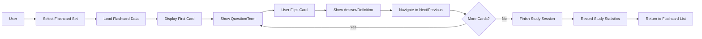
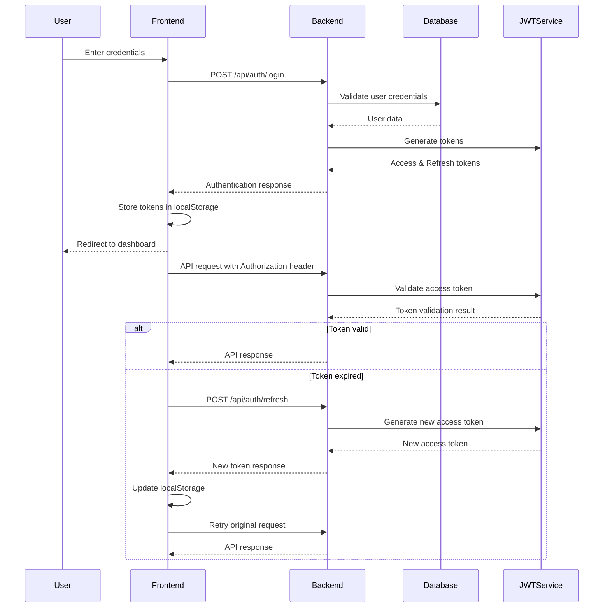
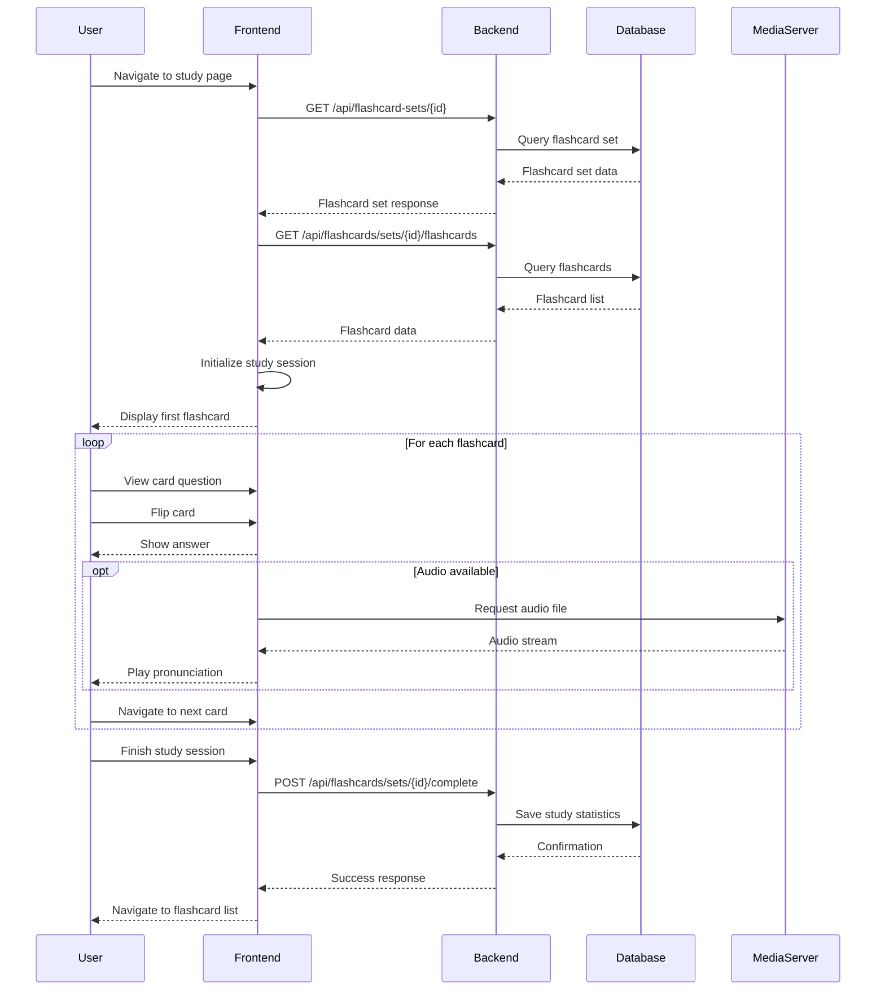
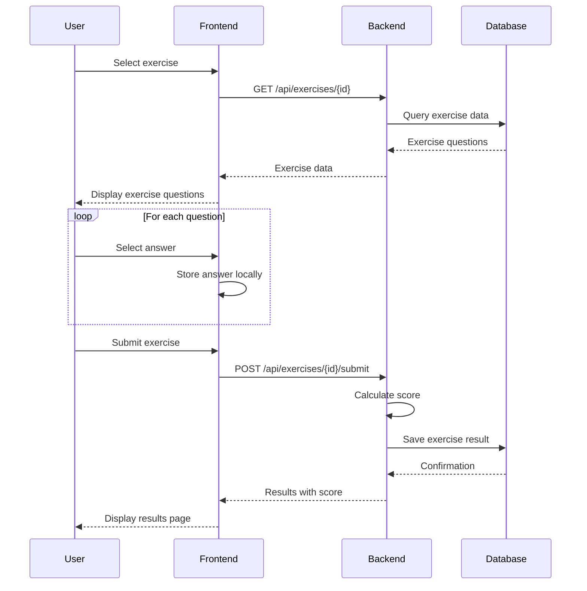
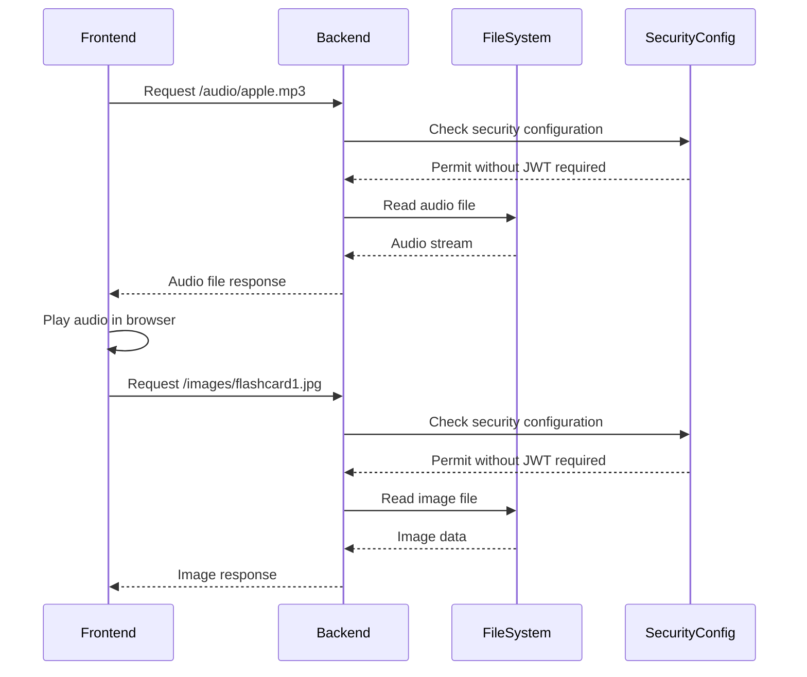
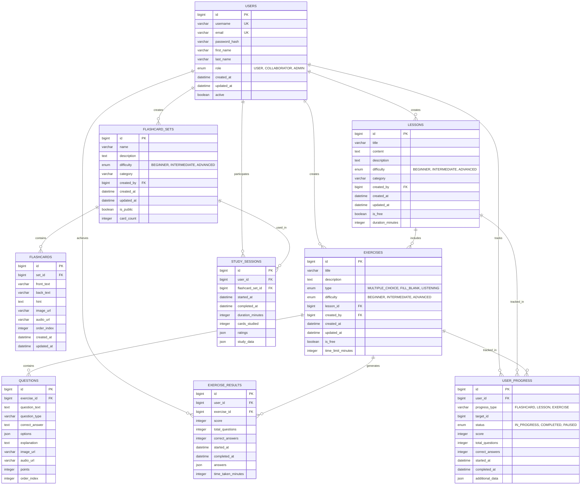
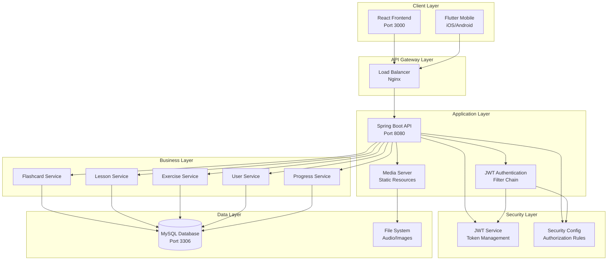
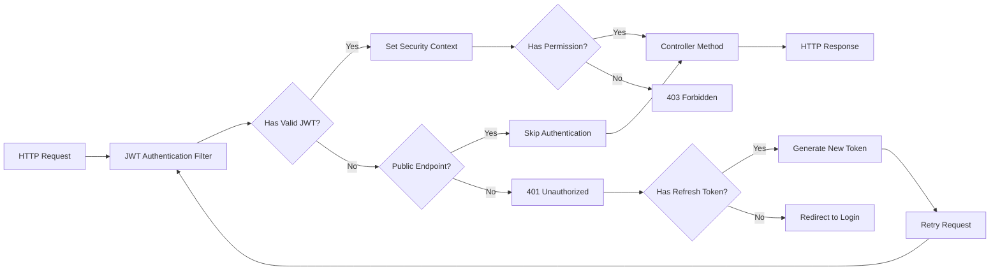

# LeEnglish TOEIC Learning System - Design Documentation

## 📋 Table of Contents

- [System Overview](#system-overview)
- [Use Case Diagrams](#use-case-diagrams)
- [Sequence Diagrams](#sequence-diagrams)
- [Entity Relationship Diagram (ERD)](#entity-relationship-diagram-erd)
- [System Architecture](#system-architecture)

---

## 🎯 System Overview

LeEnglish TOEIC Learning System is a comprehensive language learning platform with:

- **Backend**: Spring Boot REST API with JWT Authentication
- **Frontend**: React.js with TypeScript
- **Mobile**: Flutter cross-platform app
- **Database**: MySQL with JPA/Hibernate

---

## 👥 Use Case Diagrams

### Main System Use Cases

```mermaid
graph TB
    %% Actors
    A1[Guest User]
    A2[Registered User]
    A3[Collaborator]
    A4[Admin]

    %% System boundary
    subgraph "LeEnglish TOEIC System"
        %% Authentication Use Cases
        UC1[Register Account]
        UC2[Login]
        UC3[Logout]
        UC4[Refresh Token]

        %% Flashcard Use Cases
        UC5[View Public Flashcard Sets]
        UC6[Study Flashcards]
        UC7[Complete Study Session]
        UC8[Create Flashcard Set]
        UC9[Edit Flashcard Set]
        UC10[Delete Flashcard Set]
        UC11[Search Flashcards]

        %% Lesson Use Cases
        UC12[View Free Lessons]
        UC13[Take Lesson]
        UC14[Complete Lesson]
        UC15[Create Lesson]
        UC16[Edit Lesson]

        %% Exercise Use Cases
        UC17[View Free Exercises]
        UC18[Take Exercise]
        UC19[Submit Exercise]
        UC20[View Exercise Results]
        UC21[Create Exercise]
        UC22[Edit Exercise]

        %% Progress Use Cases
        UC23[View User Progress]
        UC24[Track Study Statistics]
        UC25[Generate Progress Report]

        %% Media Use Cases
        UC26[Play Audio]
        UC27[View Images]
        UC28[Upload Media]
        UC29[Manage Media Library]

        %% Admin Use Cases
        UC30[Manage Users]
        UC31[System Administration]
        UC32[View System Analytics]
    end

    %% Relationships - Guest User
    A1 --> UC1
    A1 --> UC2
    A1 --> UC5
    A1 --> UC6
    A1 --> UC12
    A1 --> UC17
    A1 --> UC26
    A1 --> UC27

    %% Relationships - Registered User
    A2 --> UC3
    A2 --> UC4
    A2 --> UC7
    A2 --> UC11
    A2 --> UC13
    A2 --> UC14
    A2 --> UC18
    A2 --> UC19
    A2 --> UC20
    A2 --> UC23
    A2 --> UC24

    %% Relationships - Collaborator (inherits User + additional)
    A3 --> UC8
    A3 --> UC9
    A3 --> UC10
    A3 --> UC15
    A3 --> UC16
    A3 --> UC21
    A3 --> UC22
    A3 --> UC28
    A3 --> UC29

    %% Relationships - Admin (inherits all + additional)
    A4 --> UC30
    A4 --> UC31
    A4 --> UC32
    A4 --> UC25
```



### Detailed Flashcard Study Use Case



---

## 🔄 Sequence Diagrams

### 1. User Authentication Flow



### 2. Flashcard Study Session Flow



### 3. Exercise Taking Flow



### 4. Media Serving Flow



---

## 🗄️ Entity Relationship Diagram (ERD)



---

## 🏗️ System Architecture

### High-Level Architecture



### API Security Flow



---

## 📁 Project Structure

```
LeEnglish-TOEIC-System/
├── backend/                    # Spring Boot REST API
│   ├── src/main/java/com/leenglish/toeic/
│   │   ├── controller/         # REST Controllers
│   │   ├── service/           # Business Logic
│   │   ├── repository/        # Data Access Layer
│   │   ├── entity/           # JPA Entities
│   │   ├── dto/              # Data Transfer Objects
│   │   ├── config/           # Configuration Classes
│   │   └── security/         # Security Implementation
│   ├── src/main/resources/
│   │   ├── static/           # Static Resources
│   │   └── application.properties
│   ├── audio/                # Audio files
│   ├── images/               # Image files
│   └── pom.xml
├── frontend/                  # React.js Frontend
│   ├── src/
│   │   ├── components/       # Reusable Components
│   │   ├── pages/           # Page Components
│   │   ├── services/        # API Services
│   │   ├── contexts/        # React Contexts
│   │   ├── types/           # TypeScript Types
│   │   └── utils/           # Utility Functions
│   ├── public/              # Public Assets
│   └── package.json
├── mobile/                   # Flutter Mobile App
│   ├── lib/
│   │   ├── models/          # Data Models
│   │   ├── screens/         # UI Screens
│   │   ├── services/        # API Services
│   │   ├── providers/       # State Management
│   │   └── main.dart
│   ├── assets/              # Mobile Assets
│   └── pubspec.yaml
└── docs/                    # Documentation
    ├── SYSTEM_DESIGN.md     # This file
    ├── API_DOCUMENTATION.md
    └── USER_GUIDE.md
```

---

## 🔗 Key Technologies

- **Backend**: Spring Boot, Spring Security, JWT, JPA/Hibernate, MySQL
- **Frontend**: React.js, TypeScript, Tailwind CSS, Axios
- **Mobile**: Flutter, Dart
- **Authentication**: JWT with refresh token mechanism
- **Media**: Static file serving with Spring Boot
- **Database**: MySQL with proper indexing and relationships
- **Security**: Role-based access control (USER, COLLABORATOR, ADMIN)

---

_This documentation provides a comprehensive overview of the LeEnglish TOEIC Learning System architecture and design patterns._
